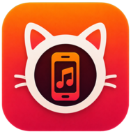

# Michi Music Mobile

<p align="center">
  
</p>

[](LICENSE)
[](https://kotlinlang.org)
[](https://developer.android.com)
[](https://developer.android.com/guide/topics/media/media3)

Android companion app for [Michi Music Player](https://github.com/pitydah/michi-music-mobile) (Linux/KDE).

Sync your music library wirelessly from your desktop and control playback remotely.

## Features

- **Local playback** — MediaStore reader with ReplayGain (ID3v2/FLAC), ExoPlayer via Media3
- **Michi Sync** — UDP discovery, HTTP registration, track streaming with Range-Request
- **Remote control** — Poll KDE player status, play/pause/next/prev/volume from phone
- **CoverFlow** — DiscreteScrollView carousel matching KDE `coverflow.py` visual constants
- **Android Auto ready** — `MediaLibraryService` with browsable tree (albums, songs, playlists)
- **Glassmorphism UI** — Dark theme (`#090B11`), 14dp radius, accent pink/purple/blue

## Tech Stack

| Layer | Library |
|-------|---------|
| Language | Kotlin 2.0 |
| UI | Jetpack Compose + Material 3 |
| Audio | AndroidX Media3 1.5.1 / ExoPlayer |
| HTTP | OkHttp 4 + Ktor Client |
| Serialization | kotlinx.serialization |
| Async | Coroutines + Flow |
| DI | Koin |
| Cache | Room (SQLite) |
| Carousel | `yarolegovich/DiscreteScrollView` 1.5.1 |

## Modules

- `:app` — Application entry, UI screens, navigation, DI wiring
- `:core` — Shared domain models (Track, Album, Playlist, Sync DTOs)
- `:data` — Room database, MediaStore reader, repositories
- `:player` — Media3 `MediaLibraryService`, custom `RenderersFactory`, ReplayGain `AudioProcessor`
- `:sync-client` — Sync protocol (UDP discovery, Ktor HTTP client, transfer manager)
- `:remote` — KDE remote control HTTP client (OkHttp)

## Screens

| Screen | Description |
|--------|-------------|
| Home | Quick play, shuffle, all tracks list, search bar |
| Library | CoverFlow carousel + album track list |
| Now Playing | Album art, seek bar, queue, play/pause/next/prev |
| Playlist | All tracks indexed list with active-track highlight |
| Remote | KDE remote control with status polling |
| Sync | Discovery, registration, download progress |
| Settings | Server config, auto-sync toggle |

## Build

```bash
export ANDROID_HOME=/path/to/android-sdk
./gradlew assembleDebug
```

APK: `app/build/outputs/apk/debug/app-debug.apk`

For release builds:

```bash
./gradlew assembleRelease
```

APK: `app/build/outputs/apk/release/app-release.apk`

Minimum SDK: 31 (Android 12)
Target SDK: 35

## Permissions

- `READ_MEDIA_AUDIO` (Android 13+) — MediaStore access
- `INTERNET`, `ACCESS_NETWORK_STATE` — HTTP sync + remote control
- `ACCESS_WIFI_STATE`, `CHANGE_WIFI_MULTICAST_STATE` — UDP peer discovery
- `FOREGROUND_SERVICE`, `FOREGROUND_SERVICE_MEDIA_PLAYBACK` — Media playback notification
- `POST_NOTIFICATIONS` — Android 13+ notification permission

## License

GPL-3.0-or-later — see [LICENSE](LICENSE) and [NOTICE](NOTICE).

Third-party components listed in [docs/THIRD_PARTY.md](docs/THIRD_PARTY.md).
