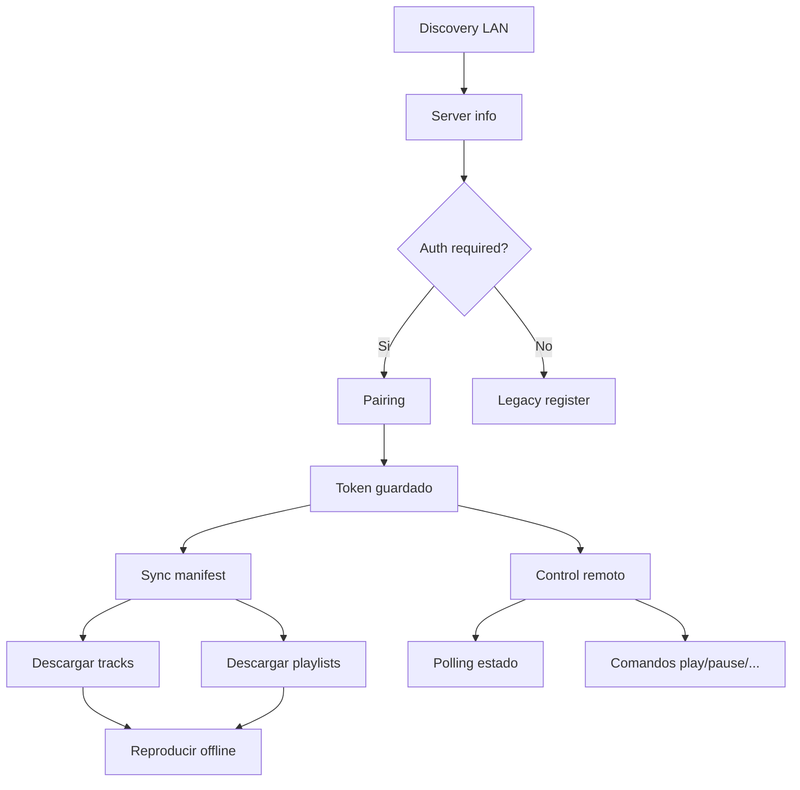

# Michi Link Mobile — Pruebas E2E

## Requisitos

- Android Studio con emulador o dispositivo físico (Android 12+, API 31)
- Michi Music Player corriendo en la misma red
- Michi Micro Server (si está disponible)
- Conexión de red local (LAN)

---

## 1. Pruebas contra Michi Music Player

### 1.1 Descubrimiento y Server Info

```bash
# Verificar que el servidor responde
curl http://<player-ip>:53318/api/v1/server/info
```

**En Mobile:**
1. Abrir Sync Screen
2. Presionar "Buscar servidores"
3. Verificar que aparece el servidor con nombre y alias
4. Verificar que muestra "Requiere emparejamiento"

**Respuesta esperada:**
```json
{
  "service": "michi-music-player",
  "name": "Michi Music Player",
  "server_id": "...",
  "michi_link_version": "1.0.0-alpha",
  "version": "3.0.0",
  "roles": ["desktop_player"],
  "auth": {
    "strategy": "PLAYER_PASSWORD",
    "required": true,
    "token_refresh": false
  }
}
```

### 1.2 Pairing

1. Seleccionar el servidor Player
2. Ingresar username y contraseña local del Player
3. Presionar "Emparejar"
4. Verificar que muestra "Emparejado y autorizado"
5. Verificar que se guarda el token en TokenStore

### 1.3 Obtener tracks

1. Una vez emparejado, presionar "Sincronizar biblioteca"
2. Verificar que el Worker descarga el manifest /api/v1/sync/manifest
3. Verificar que los tracks aparecen en "Ver biblioteca"

### 1.4 Streaming

1. Abrir NowPlaying
2. Seleccionar una canción sincronizada
3. Verificar que reproduce correctamente

### 1.5 Control remoto

1. En RemoteScreen, verificar que aparece "Controlando: Michi Music Player"
2. Verificar que play/pause funciona
3. Verificar que next/previous funciona
4. Verificar que el slider de progreso hace seek
5. Verificar que el volumen se ajusta
6. Verificar que la cola se muestra correctamente

### 1.6 Desconexión

1. Presionar "Desconectar"
2. Verificar que el estado vuelve a "Sin fuente conectada"
3. Volver a conectar sin reemparejar (token persistente)

---

## 2. Pruebas contra Michi Micro Server

### 2.1 Server Info

```bash
curl http://<micro-ip>:<port>/api/v1/server/info
```

**Respuesta esperada:**
```json
{
  "service": "michi-micro-server",
  "name": "Michi Micro Server",
  "server_id": "...",
  "michi_link_version": "1.0.0-alpha",
  "roles": ["library_server", "stream_server"],
  "auth": {
    "strategy": "SERVER_CODE",
    "required": true,
    "token_refresh": true
  },
  "features": {
    "token_refresh": true,
    "streaming": true,
    "sync": true
  }
}
```

### 2.2 Pairing por código

1. En Mobile, seleccionar el Micro Server
2. Verificar que muestra formulario de código (sin usuario/contraseña)
3. Ingresar el código mostrado por el Micro Server
4. Verificar que muestra "Emparejado y autorizado"

### 2.3 Token Refresh

1. Verificar que tokenRefreshSupported=true
2. Llamar a refresh token (automático o manual)
3. Verificar que el nuevo token se guarda

### 2.4 Sync / Download

1. Presionar "Sincronizar biblioteca"
2. Verificar que el manifest se descarga
3. Verificar que los tracks se descargan con extensión correcta
4. Verificar que el checksum SHA-256 se valida
5. Verificar que las playlists se guardan

### 2.5 Control remoto

1. Conectar RemoteScreen al Micro Server
2. Verificar que el estado se actualiza via polling
3. Probar play/pause/next/prev/seek/volume
4. Verificar que la cola funciona

---

## 3. Pruebas de modo offline

### 3.1 Sin servidores disponibles

1. Desconectar el dispositivo de la red
2. Abrir la app
3. Verificar que HomeScreen carga la biblioteca local
4. Verificar que AlbumsScreen muestra álbumes locales
5. Verificar que NowPlaying reproduce música local
6. Verificar que RemoteScreen muestra "Sin fuente conectada"
7. Verificar que SyncScreen muestra "Buscar servidores"

### 3.2 Reproducción local

1. Navegar a HomeScreen
2. Presionar "Reproducir todo"
3. Verificar que la reproducción comienza
4. Verificar que MiniPlayer muestra la canción actual
5. Verificar que PlaylistScreen muestra la cola
6. Verificar que seek, next, previous funcionan

---

## 4. Pruebas de control remoto (completas)

| Comando | Método | Resultado esperado |
|---------|--------|-------------------|
| play | `POST /api/v1/playback/control` con `{"command":"play"}` | Reproducción inicia |
| pause | `POST /api/v1/playback/control` con `{"command":"pause"}` | Reproducción pausa |
| next | `POST /api/v1/playback/control` con `{"command":"next"}` | Siguiente canción |
| previous | `POST /api/v1/playback/control` con `{"command":"previous"}` | Canción anterior |
| seek | `POST /api/v1/playback/control` con `{"command":"seek","position_ms":90000}` | Seek a 1:30 |
| set_volume | `POST /api/v1/playback/control` con `{"command":"set_volume","volume":70}` | Volumen 70% |
| stop | `POST /api/v1/playback/control` con `{"command":"stop"}` | Reproducción se detiene |
| toggle | `POST /api/v1/playback/control` con `{"command":"toggle"}` | Play ↔ Pause |
| mute | `POST /api/v1/playback/control` con `{"command":"mute"}` | Silencio |
| unmute | `POST /api/v1/playback/control` con `{"command":"unmute"}` | Restaura volumen |

### 4.1 Estados de la fuente

| Estado | Condición | UI esperada |
|--------|-----------|-------------|
| disponible | Servidor detectado | Se muestra en selector |
| reproduciendo | state=playing | Botón pause visible |
| pausado | state=paused | Botón play visible |
| sin cola | queue vacía | "Cola vacía" |
| requiere pairing | no hay token | Formulario de pairing |
| sin permisos | FORBIDDEN | Mensaje de error |
| fuera de línea | NETWORK_ERROR | "Servidor no disponible" |
| token vencido | 401 | Pedir pairing |
| incompatible | version mismatch | Mensaje de versión |

---

## 5. Pruebas de errores

### 5.1 401 Unauthorized

1. Enviar pairing con contraseña incorrecta
2. Verificar que muestra "Credenciales incorrectas"
3. Verificar que no guarda token

### 5.2 403 Forbidden / Revoked

1. Obtener token, luego revocarlo desde el servidor
2. En Mobile, al siguiente comando:
3. Verificar que muestra "Acceso denegado por el servidor"
4. Verificar que el token se borra de TokenStore

### 5.3 501 Not Implemented

1. Llamar a token/refresh en Player
2. Verificar que no crashea
3. Verificar que tokenRefreshSupported=false
4. Verificar que el feature se oculta

### 5.4 Network Error

1. Conectar Mobile a un servidor
2. Desconectar el servidor de la red
3. Verificar que RemoteScreen muestra "Servidor fuera de línea"
4. Volver a conectar: debe recuperarse automaticamente

---

## 6. Verificaciones de UI

| Pantalla | Elemento | Verificar |
|----------|----------|----------|
| HomeScreen | Search bar | Abre SearchScreen |
| HomeScreen | Quick play/shuffle | Reproduce lista completa |
| AlbumsScreen | CoverFlow | Navegación entre álbumes |
| AlbumsScreen | Track list | Reproducir por álbum |
| NowPlaying | Source selector | Selección de fuente |
| NowPlaying | Progress slider | Seek |
| NowPlaying | Volume slider | Ajuste de volumen |
| PlaylistScreen | Queue | Mostrar cola actual |
| PlaylistScreen | Clear queue | Vacía cola |
| RemoteScreen | Mode selector | Local vs Remoto |
| RemoteScreen | Remote controls | Play/pause/next/prev/seek/vol |
| RemoteScreen | Queue | Mostrar cola remota |
| SyncScreen | Discovery | Lista servidores |
| SyncScreen | Pairing form | PLAYER_PASSWORD vs SERVER_CODE |
| SyncScreen | Sync progress | Barra de progreso |
| SettingsScreen | ReplayGain | Cambiar modo |
| SettingsScreen | URL manual | Ingresar servidor manual |
| AudioRouteScreen | Audio route | Detectar salida actual |

---

## 7. Flujo de sync completo



---

## 8. Endpoints cubiertos

| Endpoint | Método | Mobile usa | Player soporta | Micro soporta |
|----------|--------|-----------|---------------|---------------|
| `GET /api/v1/status` | Health | ✅ ping() | ✅ | ✅ |
| `GET /api/v1/server/info` | Info | ✅ | ✅ | ✅ |
| `POST /api/v1/pair/start` | Pairing | ✅ | ✅ | ✅ |
| `POST /api/v1/pair/confirm` | Pairing | ✅ | ✅ | ✅ |
| `POST /api/v1/token/refresh` | Token | ✅ | ❌ (501) | ✅ |
| `GET /api/v1/tracks` | Library | ✅ | ✅ | ✅ |
| `GET /api/v1/library/stats` | Stats | ✅ | ✅ | ✅ |
| `GET /api/v1/search` | Search | ✅ | ✅ | ✅ |
| `GET /api/v1/stream/{id}` | Stream | ✅ | ✅ | ✅ |
| `GET /api/v1/download/{id}` | Download | ✅ (alias stream) | ✅ | ✅ |
| `GET /api/v1/artwork/{id}` | Artwork | ✅ | ✅ | ✅ |
| `GET /api/v1/sync/manifest` | Sync | ✅ | ✅ | ✅ |
| `GET /api/v1/sync/manifest/delta` | Delta | ✅ | ✅ | ✅ |
| `POST /api/v1/sync/state` | Sync back | ✅ | ✅ | ✅ |
| `GET /api/v1/playback/state` | Remote | ✅ | ✅ | ✅ |
| `POST /api/v1/playback/control` | Remote | ✅ | ✅ | ✅ |
| `GET /api/v1/queue` | Queue | ✅ | ✅ | ✅ |
| `POST /api/v1/queue/jump` | Queue | ✅ | ✅ | ✅ |
| `LEGACY /api/register` | Fallback | ✅ | ✅ | ❌ |

---

## 9. Pruebas automatizadas (Kotlin)

Las pruebas unitarias deben cubrir:

```kotlin
// LinkClientTest
fun testGetServerInfoPlayer()
fun testGetServerInfoMicro()
fun testPingUsesV1StatusFirst()
fun testPingFallbackLegacy()
fun testFetchLibraryUsesTracks()
fun testFetchLibraryFallback()
fun testRefreshTokenNotImplemented()
fun testRefreshTokenHonorsFlag()
fun testSendSeekSerializesPositionMs()
fun testSendVolumeSerializesVolume()
fun testGetQueueTracks()
fun testGetQueueItemsFallback()
fun testPairConfirmWithPin()

// PlaybackStateTest
fun testPlayerStateNormalization()
fun testMicroStateNormalization()
fun testCurrentTrackNull()
fun testDurationZero()

// TokenStoreTest
fun testSaveAndRetrieve()
fun testClear()
fun testTokenRefreshSupported()
fun testAuthStrategy()

// SyncViewModelTest
fun testSelectPeerPlayerPassword()
fun testSelectPeerServerCode()
fun testSelectPeerReceiverButtonBlocked()
fun testForgetServerClearsToken()
```

---

## 10. Checklist de certificación

- [ ] Build exitoso: `./gradlew assembleDebug`
- [ ] App abre sin crash en emulador
- [ ] Biblioteca local cargada correctamente
- [ ] Albums agrupados correctamente
- [ ] MiniPlayer funcional
- [ ] NowPlaying con seek y volumen
- [ ] PlaylistScreen (queue) muestra cola
- [ ] RemoteScreen sin fuente → mensaje claro
- [ ] RemoteScreen con fuente → controles funcionales
- [ ] SyncScreen descubre servidores
- [ ] SyncScreen pairing con Player (password)
- [ ] SyncScreen pairing con Micro (código)
- [ ] SyncScreen descarga manifest
- [ ] SyncScreen descarga tracks
- [ ] SettingsScreen ReplayGain se guarda
- [ ] SettingsScreen URL manual se guarda
- [ ] AudioRouteScreen detecta salida
- [ ] Modo offline sin crash
- [ ] `refreshToken()` 501 no crashea
- [ ] 401 → pedir pairing
- [ ] 403 → mostrar sin permisos
- [ ] `features.token_refresh = false` → no llama refresh
- [ ] `auth.token_refresh = false` → no llama refresh
