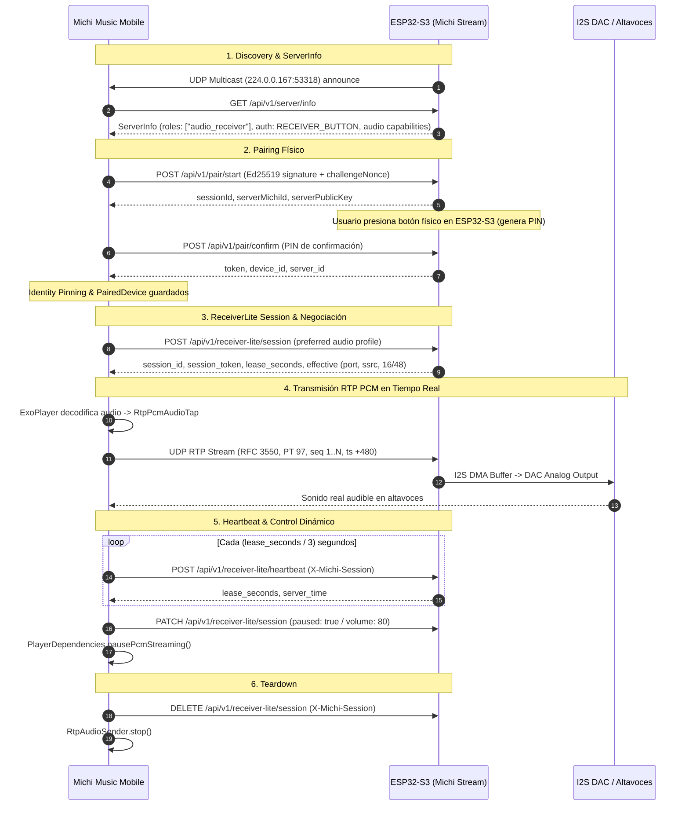

# Michi Link Mobile — Guía de Pruebas E2E y Hardware Físico

## Requisitos

- Android Studio con emulador o dispositivo físico Android (Android 12+, API 31)
- Michi Music Player o Michi Micro Server en la misma red local
- **Michi Stream (ESP32-S3 + I2S DAC: PCM5102A / MAX98357A / ES8388)** con firmware ReceiverLite
- Conexión de red local WiFi/LAN

---

## 1. Pruebas E2E contra Hardware Físico: Michi Stream (ESP32-S3 + DAC)

Este protocolo permite elevar la evidencia de pruebas de `NETWORK_E2E` a `HARDWARE_E2E`.


```mermaid
sequenceDiagram
    autonumber
    participant Mobile as Michi Music Mobile
    participant Stream as ESP32-S3 (Michi Stream)
    participant DAC as I2S DAC / Altavoces

    Note over Mobile,Stream: 1. Discovery & ServerInfo
    Stream->>Mobile: UDP Multicast (224.0.0.167:53318) announce
    Mobile->>Stream: GET /api/v1/server/info
    Stream-->>Mobile: ServerInfo (roles: ["audio_receiver"], auth: RECEIVER_BUTTON, audio capabilities)

    Note over Mobile,Stream: 2. Pairing Físico
    Mobile->>Stream: POST /api/v1/pair/start (Ed25519 signature + challengeNonce)
    Stream-->>Mobile: sessionId, serverMichiId, serverPublicKey
    Note over Stream: Usuario presiona botón físico en ESP32-S3 (genera PIN)
    Mobile->>Stream: POST /api/v1/pair/confirm (PIN de confirmación)
    Stream-->>Mobile: token, device_id, server_id
    Note over Mobile: Identity Pinning & PairedDevice guardados

    Note over Mobile,Stream: 3. ReceiverLite Session & Negociación
    Mobile->>Stream: POST /api/v1/receiver-lite/session (preferred audio profile)
    Stream-->>Mobile: session_id, session_token, lease_seconds, effective (port, ssrc, 16/48)

    Note over Mobile,DAC: 4. Transmisión RTP PCM en Tiempo Real
    Mobile->>Mobile: ExoPlayer decodifica audio -> RtpPcmAudioTap
    Mobile->>Stream: UDP RTP Stream (RFC 3550, PT 97, seq 1..N, ts +480)
    Stream->>DAC: I2S DMA Buffer -> DAC Analog Output
    DAC-->>Mobile: Sonido real audible en altavoces

    Note over Mobile,Stream: 5. Heartbeat & Control Dinámico
    loop Cada (lease_seconds / 3) segundos
        Mobile->>Stream: POST /api/v1/receiver-lite/heartbeat (X-Michi-Session)
        Stream-->>Mobile: lease_seconds, server_time
    end
    Mobile->>Stream: PATCH /api/v1/receiver-lite/session (paused: true / volume: 80)
    Mobile->>Mobile: PlayerDependencies.pausePcmStreaming()

    Note over Mobile,Stream: 6. Teardown
    Mobile->>Stream: DELETE /api/v1/receiver-lite/session (X-Michi-Session)
    Mobile->>Mobile: RtpAudioSender.stop()
```

### 1.1 Checklist Paso a Paso en Hardware Real

| Paso | Acción | Verificación en Hardware / Logs |
| :--- | :--- | :--- |
| **1. Discovery** | Conectar ESP32-S3 a la WiFi y abrir `DevicesScreen` | ESP32-S3 aparece en la lista con icono de altavoz y tipo `STREAM_RECEIVER`. |
| **2. ServerInfo** | Mobile consulta `GET /api/v1/server/info` | Contiene `roles: ["audio_receiver"]`, `authStrategy: "RECEIVER_BUTTON"` y `audio.supported_codecs: ["pcm_s16le"]`. |
| **3. Pairing** | Presionar "Emparejar", presionar botón en ESP32-S3 e introducir el PIN | Diálogo `ReceiverButtonPairingDialog` valida el PIN. Credenciales y clave pública Ed25519 quedan fijadas (`identity pinning`). |
| **4. Handoff a Stream** | En `NowPlaying` o selector de salida, elegir el receptor Michi Stream | `PlaybackSessionManager` ejecuta `POST /api/v1/receiver-lite/session`, inicializa `RtpPcmAudioTap` y arranca `RtpAudioSender`. |
| **5. Salida DAC** | Reproducir cualquier pista FLAC/MP3 | El audio PCM decodificado se transmite por RTP UDP hacia el puerto negociado (`stream_port`). El DAC emite música continua y limpia sin buffer underruns ni cortes. |
| **6. Heartbeat** | Mantener reproducción durante > 30 segundos | El log de ESP32-S3 muestra heartbeats periódicos con header `X-Michi-Session`. |
| **7. Pause / Resume** | Presionar Pausa en NowPlaying | `PATCH /receiver-lite/session` envía `paused: true`. Mobile suspende el flujo PCM. El receptor detiene la salida I2S sin ruido residual. Al reanudar, la música continúa de inmediato. |
| **8. Volumen** | Mover el slider de volumen | `PATCH /receiver-lite/session` actualiza el volumen en hardware (`volume: 0..100`). |
| **9. Teardown** | Cambiar salida a "Este teléfono" | Se envía `DELETE /receiver-lite/session`, el socket UDP se cierra y la reproducción vuelve al altavoz local sin interrupción. |
| **10. Reconnect** | Reconectar al ESP32-S3 | Se valida la identidad criptográfica fija (`michi_id`, `public_key`). Si el ESP32-S3 fue reiniciado con claves distintas, Mobile rechaza la sesión con `UNAUTHORIZED`. |

---

## 2. Pruebas contra Michi Music Player (Desktop)

### 2.1 Descubrimiento y Server Info
```bash
curl http://<player-ip>:53318/api/v1/server/info
```

**En Mobile:**
1. Abrir `SyncScreen` o `DevicesScreen`.
2. Verificar que aparece el servidor de escritorio con `roles: ["desktop_player"]`.
3. Emparejar con `PLAYER_PASSWORD` (usuario y contraseña del reproductor de escritorio).

### 2.2 Handoff de Cola y Control Remoto
1. Transferir cola activa desde Mobile (`POST /api/v1/queue/transfer`).
2. Mobile resuelve canónicamente las pistas locales en el catálogo del reproductor remoto. Si alguna pista no existe, aborta de forma segura e informa al usuario.
3. Comprobar play/pause/next/prev/seek/volumen bidireccional en tiempo real con SSE (`EventClient`).

---

## 3. Pruebas contra Michi Micro Server

### 3.1 Pairing por Código y Token Refresh
1. En `DevicesScreen`, seleccionar el servidor detectado con estrategia `SERVER_CODE`.
2. Ingresar el PIN mostrado en la terminal del servidor.
3. Probar sincronización de biblioteca (`/api/v1/sync/manifest`), descarga y validación SHA-256 de archivos.
4. Validar renovación automática de token en respuesta a `401 Unauthorized` mediante `POST /api/v1/auth/refresh`.

---

## 4. Matriz de Endpoints y Cobertura

| Endpoint | Método | Uso en Mobile | Protocolo |
| :--- | :--- | :--- | :--- |
| `/api/v1/status` | GET | Health check / ping | Michi Core |
| `/api/v1/server/info` | GET | Capabilities, roles y audio formats | Michi Core |
| `/api/v1/pair/start` | POST | Inicio de pairing criptográfico (Ed25519) | Michi Auth |
| `/api/v1/pair/confirm` | POST | Confirmación con PIN / firma | Michi Auth |
| `/api/v1/auth/refresh` | POST | Renovación automática de token | Michi Auth |
| `/api/v1/receiver-lite/session` | POST | Creación de sesión RTP de audio | ReceiverLite |
| `/api/v1/receiver-lite/heartbeat` | POST | Heartbeat periódico con `X-Michi-Session` | ReceiverLite |
| `/api/v1/receiver-lite/session` | PATCH | Control de volumen y pausa/reanudación | ReceiverLite |
| `/api/v1/receiver-lite/session` | DELETE | Destrucción y teardown de sesión | ReceiverLite |
| `/api/v1/queue/transfer` | POST | Transferencia de cola de reproducción | Michi Link |
| `/api/v1/events` | GET | Streaming de eventos SSE | Michi Link |
