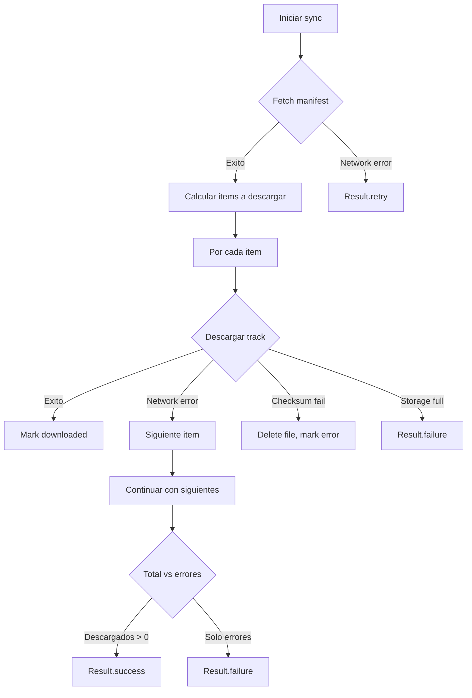

# Michi Mobile — Sync Resilience

## Estrategia de reintentos

| Error | Comportamiento | WorkManager |
|-------|---------------|-------------|
| Network timeout | `Result.retry()` | Backoff exponencial |
| IOException (red) | `Result.retry()` | Backoff exponencial |
| IOException (disco) | `Result.failure()` | No reintentar |
| HTTP 401 | `Result.failure()` | No reintentar |
| HTTP 403 | `Result.failure()` | No reintentar |
| HTTP 501 | `Result.failure()` | No reintentar |
| Checksum mismatch | Error por track, resto continúa | — |
| Almacenamiento insuficiente | `Result.failure()` | No reintentar |
| LinkException genérico | `Result.failure()` | No reintentar |

## WorkManager retry policy

Default: exponential backoff con:
- Initial delay: 10 segundos
- Multiplier: 2x
- Max delay: 5 minutos
- Max retries: ilimitado (hasta que tenga éxito o falle permanentemente)

## Network lost durante descarga



## Checksum verification

```kotlin
// LinkTransferManager.kt
private fun verifyChecksum(file: File, expected: String): Boolean {
    val digest = MessageDigest.getInstance("SHA-256")
    FileInputStream(file).use { fis ->
        val buffer = ByteArray(8192)
        var read: Int
        while (fis.read(buffer).also { read = it } != -1) {
            digest.update(buffer, 0, read)
        }
    }
    val hex = digest.digest().joinToString("") { "%02x".format(it) }
    return hex == expected.lowercase()
}
```

## Almacenamiento

```kotlin
// SyncWorker.kt
val storage = StatFs(applicationContext.filesDir.absolutePath)
val freeBytes = storage.availableBytes
val minFree = 50L * 1024 * 1024 // 50MB
if (freeBytes < minFree) {
    return Result.failure(...)
}
```

## Estados de descarga en UI

```kotlin
sealed class SyncProgress {
    Idle                    // Sin actividad
    Downloading(completed, total)  // En progreso
    Complete(tracks, downloaded, errors) // Finalizado
    Error(message)          // Error
}
```
